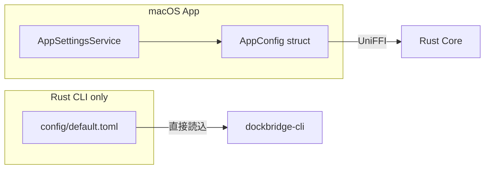
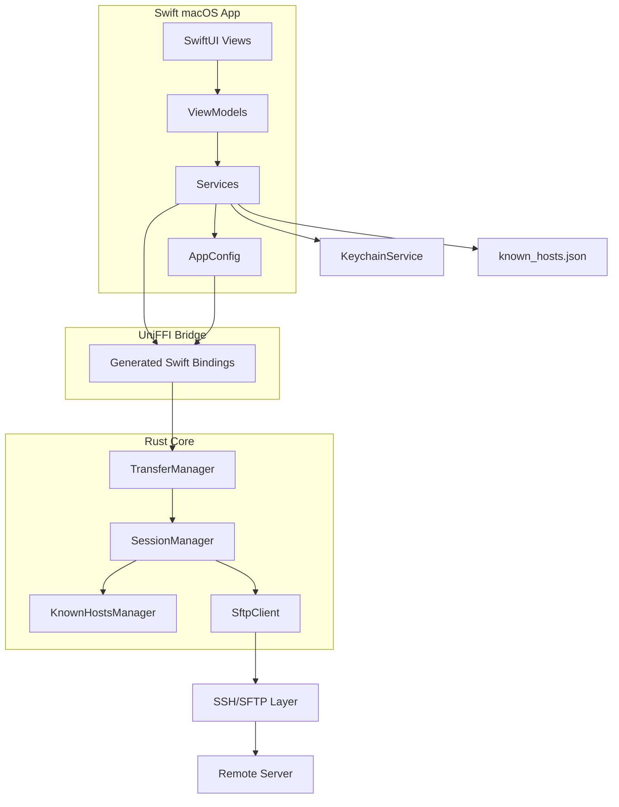
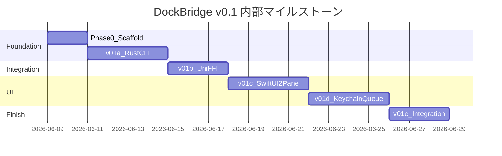

# DockBridge v0.1 実装計画

## 作業目的

[DockBridge](README.md) を、WinSCP ライクな macOS ネイティブ SFTP クライアントの **v0.1（§11 必須機能）** として立ち上げる。現状は Initial commit のみで実装はゼロ。

## 現状

```text
.
├── README.md          # プロジェクト名・一行説明のみ
└── .gitattributes
```

設計書はリポジトリ未コミット。`{{APP_NAME}}` は **DockBridge** に置換する。

## 確定した前提

| 項目 | 決定内容 |
|------|----------|
| アプリ名 | DockBridge |
| v0.1 スコープ | §11 必須機能（秘密鍵認証・Keychain・転送キュー・最低限ホスト鍵確認含む） |
| 最低 macOS | **15 Sequoia** 以降 |
| v0.1 で除外 | OpenSSH `known_hosts` 完全互換、SCP、外部エディタ、D&D、chmod、SSH config、同期（§12 以降） |
| プロダクト表記 | SFTP クライアントとして訴求。SCP は v1.0 以降の検討事項としてのみ言及 |

## プロダクト表記方針

v0.1 では実装の中心は SFTP のみ。README・`docs/product.md` では次の表記を用いる。

```text
DockBridge is a macOS-native SFTP client inspired by WinSCP.
```

SCP については将来検討として控えめに記載する。

```text
SCP support may be considered after v1.0.
```

設計書の「SFTP/SCP」と書かれている箇所は、ドキュメント化時に SFTP 中心の表現へ修正する。

## 技術選定

### Rust SSH/SFTP: `russh` + `russh-sftp`

- **理由**: Pure Rust・async/tokio ベースで転送キュー・進捗通知と相性が良い。v2.1+ で concurrent writes 対応済み（[russh-sftp #85](https://github.com/AspectUnk/russh-sftp/issues/70)）
- **補助 crate**: `ssh-key`（OpenSSH 形式の秘密鍵読み込み）、`tokio`（非同期ランタイム）、`zeroize`（秘密情報の破棄）
- **代替案**: 接続安定性で詰まった場合のみ `ssh2`（libssh2）へ切替を検討

### Swift-Rust 連携: UniFFI（proc-macro 方式）

- 設計書の UDL（`app.udl`）方針を踏襲しつつ、**proc-macro + `uniffi-bindgen-swift`** を採用（[公式 Xcode 連携ガイド](https://mozilla.github.io/uniffi-rs/latest/swift/xcode.html)）
- Rust static lib → XCFramework（`aarch64-apple-darwin` / `x86_64-apple-darwin`）→ Xcode リンク

### Swift 側永続化

| データ | 保存先 |
|--------|--------|
| パスワード・鍵パスフレーズ | macOS Keychain（`Security` framework） |
| 接続プロファイル（ホスト・ユーザー等） | `~/Library/Application Support/DockBridge/profiles.json` |
| 承認済みホスト鍵 | `~/Library/Application Support/DockBridge/known_hosts.json`（DockBridge 独自形式、権限 `0600`） |
| アプリ設定 | `UserDefaults` + Application Support 内設定ファイル |

### ホスト鍵フィンガープリント表示形式

OpenSSH と同じ **SHA256 形式**を基本表示とする。

```text
SHA256:xxxxxxxxxxxxxxxxxxxxxxxxxxxxxxxxxxxxxxxxxxx
```

MD5 形式（`MD5:aa:bb:cc:...`）は詳細表示（展開パネル等）に留め、デフォルト UI では SHA256 のみ表示する。

### `known_hosts.json` のファイル権限

- 保存先: `~/Library/Application Support/DockBridge/known_hosts.json`
- 権限: 可能な限り **ユーザー本人のみ読み書き可能**（`chmod 0600`）
- Swift `HostKeyStore` および Rust CLI の書き込み時に権限を設定する
- CLI 開発用ストア（`~/.dockbridge/known_hosts.json`）も同様に `0600` を適用

## 設定管理方針

**アプリ本体では Swift を設定の入口にする。** Rust は「渡された設定で動く Core」に徹する。



| 経路 | 設定の読み込み元 |
|------|------------------|
| macOS アプリ | Swift `AppSettingsService` → `AppConfig` を組み立て → UniFFI で Rust Core に渡す |
| Rust CLI（開発・検証用） | [`config/default.toml`](config/default.toml) を直接読む |
| 配布時の配置 | `~/Library/Application Support/DockBridge/` を基本（App Bundle 内はデフォルト値のみ） |

**`AppConfig` に含める項目（例）**:
- 接続タイムアウト
- 転送リトライ回数
- デフォルトローカルパス
- 削除確認の ON/OFF
- 隠しファイル表示

Rust Core 側は `AppConfig` を受け取って動作し、設定ファイルのパス解決や Bundle 探索は行わない。

## v0.1 で追加するセキュリティ最低ライン

| 項目 | v0.1 | v0.2 |
|------|------|------|
| 初回接続時のホスト鍵フィンガープリント表示 | 必須 | — |
| ユーザーによる accept / reject | 必須 | — |
| 承認済みホスト鍵の DockBridge 内保存 | 必須 | — |
| ホスト鍵変更時の接続ブロック | 必須 | — |
| OpenSSH `~/.ssh/known_hosts` 互換読み書き | — | 必須 |
| ホスト鍵変更時の厳格な警告 UI | 基本ブロックのみ | 詳細警告 |
| パスワード・鍵パスフレーズのログ出力禁止 | 必須 | — |
| Rust 側で秘密情報を `Debug` 表示しない | 必須 | — |
| `zeroize` による秘密情報の破棄 | 可能な範囲で必須 | — |
| 秘密鍵ファイルのアプリ内コピー禁止 | 必須 | — |
| root 接続時の警告 | 必須 | — |
| 削除操作の確認ダイアログ | 必須 | — |

## 目標アーキテクチャ



## 目標ディレクトリ構成

設計書 §21 をベースに調整:

```text
DockBridge/
├── apps/macos/
│   ├── DockBridge.xcodeproj
│   └── DockBridge/
│       ├── App/
│       ├── Views/          # Main, Connection, Transfer, Settings, HostKeyConfirm
│       ├── ViewModels/
│       ├── Models/         # AppConfig, ConnectionProfile
│       ├── Services/       # Keychain, AppSettings, HostKeyStore, RustBridge
│       └── Resources/
├── crates/
│   ├── core/
│   │   └── src/
│   │       ├── ssh/
│   │       ├── sftp/
│   │       ├── transfer/
│   │       ├── security/   # KnownHostsManager
│   │       └── error.rs
│   └── uniffi/
├── config/
│   └── default.toml        # Rust CLI 専用デフォルト設定
├── docs/
│   ├── product.md
│   ├── architecture.md
│   ├── security.md
│   └── roadmap.md
├── scripts/
│   ├── build-rust.sh
│   └── generate-uniffi.sh
├── Cargo.toml
└── rust-toolchain.toml
```

## v0.1 内部マイルストーン

Phase 0〜5 を、より細かい完成地点に分割する。各マイルストーン完了時に動作確認可能な状態を作る。

### v0.1-a: Rust CLI SFTP（Phase 0 + Phase 1 前半）

**ゴール**: CLI だけで SFTP 接続・一覧・上下転送が動く。

| 項目 | 内容 |
|------|------|
| 接続 | パスワード認証 |
| 操作 | `list` / `upload` / `download` |
| ホスト鍵 | 初回フィンガープリント表示、accept/reject、DockBridge ストア保存、変更時ブロック |
| 設定 | CLI は `config/default.toml` を直接読む |
| 検証 | `docker run atmoz/sftp` 等で手動確認 |

### v0.1-b: UniFFI 疎通（Phase 1 後半 + Phase 2）

**ゴール**: Swift アプリ（最小 UI）から `listDirectory` が呼べる。

**最優先検証（v0.1-b の最初に着手）**:

Rust 接続途中で `HostKeyChallenge` を Swift 側へ通知し、Swift の accept/reject 結果を Rust に返せること。`listDirectory` の疎通より先にこのコールバック経路を通す。

```text
Rust connect()
  → HostKeyChallenge(host, port, fingerprint_sha256) を Swift へ通知
  → Swift がダイアログ表示（SHA256 表示）
  → accept / reject を Rust に返却
  → 接続続行 or 中断
```

| 項目 | 内容 |
|------|------|
| 最優先 | `HostKeyChallenge` コールバックの往復検証 |
| 連携 | XCFramework 生成、Xcode Build Phase 組込 |
| API | `connect` + `listDirectory` + `disconnect` |
| 設定 | Swift が `AppConfig` を組み立てて UniFFI 経由で渡す |
| 検証 | ホスト鍵コールバック → Swift からリモート一覧表示の順で確認 |

### v0.1-c: SwiftUI 2ペイン（Phase 3 前半 + Phase 4 前半）

**ゴール**: 実用的な 2 ペイン UI と接続先管理が動く。

| 項目 | 内容 |
|------|------|
| UI | ローカル / リモート 2 ペイン、パスバー |
| 接続 | 接続先一覧・接続設定画面 |
| ホスト鍵 | accept / reject ダイアログ（`HostKeyConfirmView`） |
| 操作 | 一覧表示、upload / download |
| 永続化 | 接続プロファイル保存（Application Support） |

### v0.1-d: Keychain + 秘密鍵 + 転送キュー（Phase 3 後半 + Phase 4 後半）

**ゴール**: 実務的な認証と転送管理が動く。

| 項目 | 内容 |
|------|------|
| 認証 | 秘密鍵認証、Keychain にパスワード・パスフレーズ保存 |
| 転送 | 転送キュー UI、順次転送、進捗表示、キャンセル |
| セキュリティ | ログマスク、`zeroize`、秘密鍵パス参照のみ |

### v0.1-e: ファイル操作 + 統合確認（Phase 5）

**ゴール**: v0.1 成功条件をすべて満たす。

| 項目 | 内容 |
|------|------|
| 操作 | delete / rename / mkdir |
| セキュリティ | 削除確認、root 警告、ホスト鍵変更ブロックの E2E 確認 |
| テスト | macOS 15 で接続→操作→転送の一連フロー |

## v0.1 機能マップ（§11）

| 機能 | 主担当レイヤー | マイルストーン |
|------|----------------|----------------|
| SFTP 接続 | Rust `core` | a |
| ホスト鍵確認（最低限） | Rust `KnownHostsManager` + Swift UI | a, c |
| パスワード認証 | Rust `core` | a |
| 秘密鍵認証 | Rust `core` + Swift Keychain | d |
| ローカル / リモート一覧 | Rust + SwiftUI | b, c |
| upload / download | Rust `TransferManager` | a, c |
| 2ペイン UI | SwiftUI | c |
| 接続先保存 | Swift `ConnectionStore` | c |
| Keychain 保存 | Swift `KeychainService` | d |
| 転送キュー | Rust + SwiftUI | d |
| delete / rename / mkdir | Rust `core` | e |
| エラー分類・表示 | Rust `AppError` → UniFFI → Swift | 全段階 |

**v0.2 以降**: OpenSSH `known_hosts` 互換、外部エディタ、D&D、chmod、SSH config

## 使用 subagent と担当

| subagent | 担当 |
|----------|------|
| `rust-engineer` | `crates/core` の SSH/SFTP・転送キュー・KnownHostsManager・エラー型 |
| `swift-expert` | Xcode プロジェクト、SwiftUI 2ペイン、ViewModel、AppConfig |
| `security-engineer` | Keychain、ホスト鍵フロー、ログマスク、`zeroize` レビュー |
| `devops-engineer` | `scripts/`、XCFramework ビルド、CI 骨格 |
| `code-reviewer` | マイルストーン完了ごとの境界設計・セキュリティレビュー |

## 実装フェーズ（Phase 0〜5 とマイルストーンの対応）

### Phase 0: リポジトリ骨格 → v0.1-a 準備

**修正対象ファイル（新規）**:
- [`docs/product.md`](docs/product.md) ほか設計書 4 ファイル（セキュリティ・設定方針・内部マイルストーンを追記）
- [`Cargo.toml`](Cargo.toml)、[`rust-toolchain.toml`](rust-toolchain.toml)
- [`config/default.toml`](config/default.toml)（**CLI 専用**）
- [`scripts/build-rust.sh`](scripts/build-rust.sh)、[`scripts/generate-uniffi.sh`](scripts/generate-uniffi.sh)

**内容**:
- 設計書を `{{APP_NAME}}` → DockBridge で `docs/` に配置
- Cargo workspace 作成（`core`, `uniffi` crates）
- macOS 15 を `MACOSX_DEPLOYMENT_TARGET` / Xcode で明示

### Phase 1: Rust Core → v0.1-a

**修正対象**: [`crates/core/src/`](crates/core/src/)

**v0.1-a で実装する API**:

```rust
// 接続（ホスト鍵コールバック付き）
connect(profile, app_config, host_key_callback) -> SessionId
disconnect(session_id)
list_directory(session_id, path) -> Vec<RemoteFile>
upload(session_id, local_path, remote_path) -> TransferId
download(session_id, remote_path, local_path) -> TransferId
```

**KnownHostsManager**:
- `check_host_key(host, port, key) -> HostKeyAction`（Trust / Reject / Unknown）
- フィンガープリントは SHA256 形式で生成・表示
- DockBridge 独自 JSON ストアへの読み書き（CLI は `~/.dockbridge/`、アプリは Application Support パスを Swift から渡す）
- 書き込み時にファイル権限 `0600` を設定

**v0.1-a 実装順序**:

```text
1. Cargo workspace 作成
2. Rust CLI で password 認証の SFTP list
3. ホスト鍵フィンガープリント表示（SHA256）
4. accept/reject + known_hosts.json 保存（0600）
5. upload/download
```

**検証**: `dockbridge-cli` + Docker SFTP で接続・一覧・転送・ホスト鍵フローを手動確認。

### Phase 2: UniFFI ブリッジ → v0.1-b

**修正対象**: [`crates/uniffi/`](crates/uniffi/)

**実装順序**:

```text
1. XCFramework 生成スクリプト整備
2. HostKeyChallenge コールバックの UniFFI エクスポートと往復検証（最優先）
3. AppConfig / RemoteFile / AppError のエクスポート
4. connect + listDirectory + disconnect
```

- `HostKeyChallenge` 型: `host`, `port`, `fingerprint_sha256` を Swift へ通知
- Swift 側は `HostKeyConfirmView`（最小版）で accept/reject を返す
- `connect(profile, app_config, host_key_handler)` で Swift 組み立ての設定を受け取る
- XCFramework 生成 + Xcode Build Phase 組込

**期待挙動**: ホスト鍵コールバックが動いた後、Swift から `AppConfig` を渡して `listDirectory` が動く。

### Phase 3: Swift サービス層 → v0.1-c / v0.1-d

**修正対象**: [`apps/macos/DockBridge/Services/`](apps/macos/DockBridge/Services/)

| Service | 責務 | マイルストーン |
|---------|------|----------------|
| `AppSettingsService` | 設定読込 → `AppConfig` 組み立て | b |
| `HostKeyStore` | `known_hosts.json` の読み書き | c |
| `ConnectionStore` | 接続プロファイル CRUD | c |
| `KeychainService` | パスワード・パスフレーズ保存/取得 | d |
| `RustBridgeService` | UniFFI ラッパー、エラー変換、ホスト鍵 UI 連携 | b〜d |

### Phase 4: SwiftUI → v0.1-c / v0.1-d

**修正対象**: [`apps/macos/DockBridge/Views/`](apps/macos/DockBridge/Views/)

```text
┌──────────────────────────────────────────────┐
│ DockBridge                                   │
├──────────────────────┬───────────────────────┤
│ LocalPane            │ RemotePane            │
├──────────────────────┴───────────────────────┤
│ TransferQueueView                            │
└──────────────────────────────────────────────┘
```

| 画面 | マイルストーン |
|------|----------------|
| メイン 2ペイン + upload/download | c |
| 接続先一覧・接続設定 | c |
| ホスト鍵確認ダイアログ | c |
| 転送キュー | d |
| 設定（削除確認等） | d |
| エラー表示 | 全段階 |

### Phase 5: 統合・セキュリティ → v0.1-e

- delete / rename / mkdir の UI 連携
- ホスト鍵変更時の接続ブロック E2E 確認
- Keychain / ログマスク / `zeroize` のセキュリティレビュー
- root 接続警告、削除確認ダイアログ
- v0.1 成功条件の最終検証

## Swift-Rust 境界の守り方

設計書 §9 を厳守:

- Swift は「操作単位」で Rust を呼ぶ（1ファイルごとの細かい往復は避ける）
- Rust に UI 状態を持たせない（ホスト鍵の accept/reject 判断は Swift が行い、結果を Rust に返す）
- 設定は Swift → `AppConfig` → Rust の一方向
- 転送進捗は Rust 側で管理し、Swift はポーリングまたはコールバックで表示更新

## 確認・テスト方針

| レイヤー | 方法 | マイルストーン |
|----------|------|----------------|
| Rust Core | ユニットテスト + CLI 手動テスト | a |
| ホスト鍵フロー | 初回 accept、再訪問スキップ、鍵変更ブロック、SHA256 表示 | a, e |
| UniFFI HostKeyChallenge | Rust 接続中の accept/reject 往復 | b（最優先） |
| UniFFI listDirectory | Swift スモークテスト | b |
| ファイル権限 | `known_hosts.json` が `0600` であること | a, c |
| Swift UI | macOS 15 E2E | c, d, e |
| セキュリティ | Keychain 確認、ログ grep、`zeroize` レビュー | d, e |

**v0.1 成功条件**（設計書 §25 + セキュリティ最低ライン）:
- Mac アプリとして起動できる
- SFTP サーバーに接続できる（パスワード・秘密鍵）
- 初回接続時にホスト鍵フィンガープリントが表示され、accept/reject できる
- ホスト鍵変更時に接続がブロックされる
- リモートファイル一覧を表示できる
- アップロード・ダウンロード・削除・リネーム・mkdir ができる
- 最低限の 2 ペイン操作ができる
- 転送キューが動作する
- 認証情報が Keychain に保存される

## リスクと対策

| リスク | 対策 |
|--------|------|
| v0.1 スコープが重い | v0.1-a〜e の内部マイルストーンで段階確認 |
| UniFFI + Xcode ビルドの複雑さ | `scripts/` で再現可能なビルド手順を先に固める |
| ホスト鍵 UI と Rust の非同期連携 | v0.1-b 最初のタスクとして `HostKeyChallenge` コールバックを検証 |
| `russh-sftp` の転送性能 | `max_concurrent_writes` 設定で対応。SCP は v1.0 以降の検討事項 |
| 設定ファイル配置の混乱 | Swift を唯一の入口にし、CLI のみ `default.toml` を使用 |
| App Sandbox | v0.1 は Sandbox 無効 or ネットワーク entitlement 付きで開始、配布前で整理 |

## 最初の実装順序（着手時チェックリスト）

v0.1-a〜b の土台固めはこの順で進める。

```text
1. Cargo workspace 作成
2. Rust CLI で password 認証の SFTP list
3. ホスト鍵フィンガープリント表示（SHA256）
4. accept/reject + known_hosts.json 保存（0600）
5. upload/download
6. UniFFI で HostKeyChallenge コールバック検証
7. UniFFI で Swift から listDirectory
```

6 が通れば DockBridge の Swift/Rust 境界の最大リスクは解消される。

## 実装後のロードマップ（参考）

v0.1 完了後:
- **v0.2**: OpenSSH `known_hosts` 互換、外部エディタ、D&D、chmod、SSH config
- **v0.3**: 同期プレビュー、ワークスペース
- **1.0**: [Developer ID 署名 + Notarization](https://developer.apple.com/developer-id/)（Gatekeeper 対応）
- **1.0 以降**: SCP 対応の検討（`SCP support may be considered after v1.0.`）


