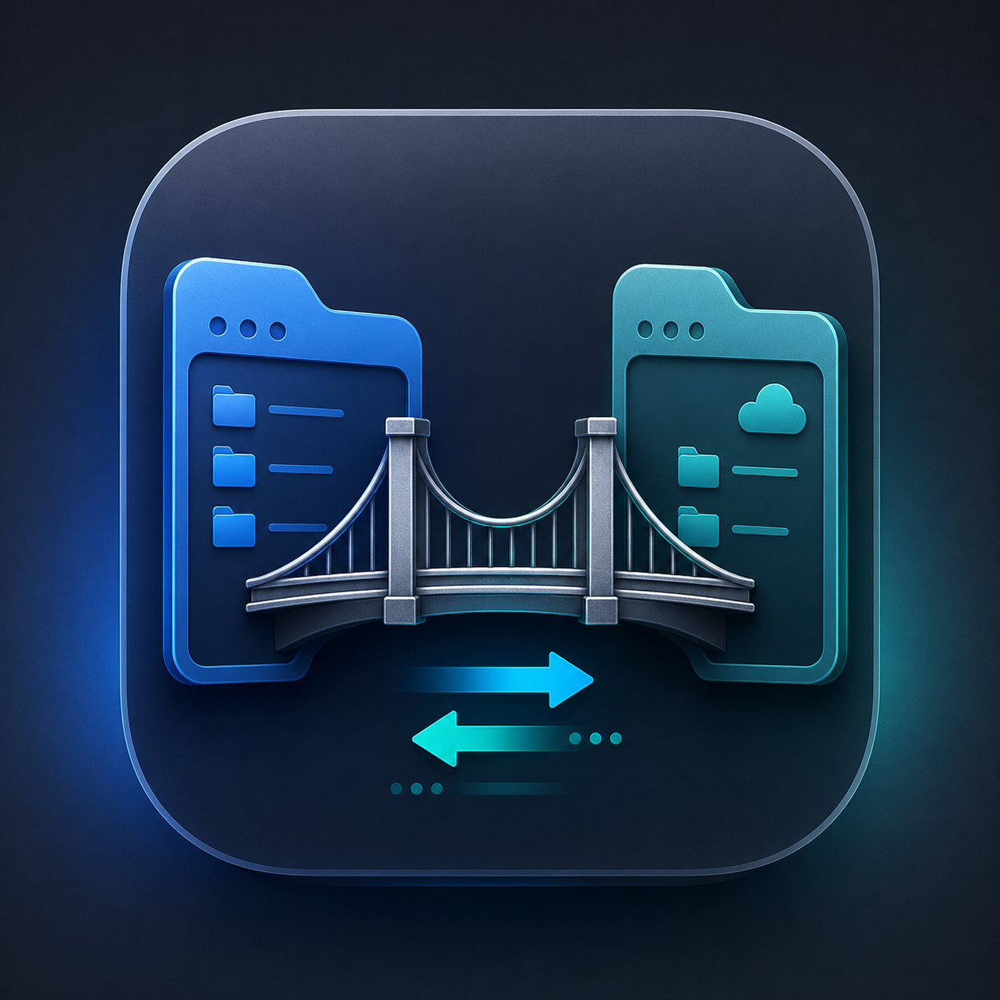

# DockBridge

<p align="center">
  
</p>

DockBridge is a macOS-native SFTP client inspired by WinSCP.

SCP support may be considered after v1.0.

## Download

Pre-built macOS releases are available on the [download site](https://t3pp31.github.io/DockBridge/) and [GitHub Releases](https://github.com/T3pp31/DockBridge/releases).

- Requires macOS 15 Sequoia or later
- Releases are Developer ID signed and notarized

## Requirements

- macOS 15 Sequoia or later
- Rust stable toolchain
- Xcode 16+

## Build

```bash
# Rust workspace
cargo build --release

# CLI (development)
cargo run -p dockbridge-cli -- list --help

### CLI password authentication

Prefer `--password-stdin` for scripts, CI, and production. The password is not stored in argv, shell history, or `ps` output:

```bash
printf '%s\n' "$PASSWORD" | cargo run -q -p dockbridge-cli -- list \
  --host 127.0.0.1 --user demo --password-stdin --path upload
```

The `--password` flag is for local development and testing only. Passwords on the command line may appear in shell history and process listings (CWE-214). In CI and release builds, the CLI prints a warning when `--password` is used.

To remove `--password` entirely, build with `--features disable-cli-password` on `dockbridge-cli`.

# Rust static lib + Swift bindings
./scripts/build-rust.sh
./scripts/generate-uniffi.sh
```

Open `apps/macos/DockBridge.xcodeproj` in Xcode to build the macOS app.

## Project layout

```text
crates/core/     Rust SFTP core
crates/uniffi/   UniFFI bridge
crates/cli/      Development CLI
apps/macos/      SwiftUI macOS app
config/          CLI default configuration
docs/            Product and architecture docs
scripts/         Build helpers
```

## License

MIT
